# Kube Console — Kubernetes 管理平台

参考 [Kuboard](https://www.kuboard.cn/) 设计的一体化 Kubernetes 管理平台（云厂商控制台风格，浅色/深色双主题），把日常运维要用的东西收在一个登录态里：**多集群接入与全资源浏览编辑、工作负载与 Pod 运维（终端 / 文件 / 驱逐 / 日志采集）、Prometheus 监控与 Alertmanager 告警、ES 日志与事件归档检索、内置 Tekton CI + ArgoCD / Helm 交付、Harbor 镜像与 Trivy 漏洞、Nacos 微服务集成、KubeSphere 式三层授权与操作审计**。

资源数据不缓存、每次直连 kube-apiserver；外部系统（Prometheus / ES / Harbor / Tekton / ArgoCD / Velero / Nacos）未接入时相关页面优雅降级并给出配置指引，不报错。

> 以下截图取自一套接入真实生产集群（14 节点 / 18 命名空间 / 124 Deployment）的部署实例。

## 界面与交互

- **主题**：KubeSphere 4.2 风格——品牌绿主色（`#00AA55`）+ 深色侧边栏（菜单项全量图标、活动项左侧绿色指示条）+ 浅灰内容区；深色模式在用户菜单切换；主题色集中定义于 `web/src/styles/theme.css`
- **全局搜索**：顶栏搜索框，输入即搜（Pod / 工作负载 / Service / ConfigMap / 命名空间 / 节点），结果按类型分组，点击直达详情
- **全局命名空间选择**：顶栏命名空间多选（含「全选」），命名空间相关页面联动跟随；筛选状态与 URL 同步（`?namespace=` 刷新/分享可复现）
- **全局集群切换**：顶栏下拉切换已注册集群（`X-Cluster` 请求头）；集群不可达时展示告警面板与「重新检测」，不会把请求挂死
- **左树右面板**：工作负载 / Pod 详情页左侧资源树（工作负载 → Pod → 容器，状态色点），右侧面板联动
- **行点击进详情**：所有资源列表支持行点击直达详情（操作列按钮不受影响）；Service 列表例外——点击名称展示 **selector 匹配的后端 Pod 列表**（状态/就绪/重启/IP/节点），YAML 详情走操作列
- **个人能力**：修改密码、**个人 API Token**（创建 / 吊销，脚本化调用 `Authorization: Bearer`）、深色模式

### 集群总览（监控下钻的第一级）

节点 / Pod / 工作负载 / 命名空间统计卡，CPU·内存·磁盘·网络使用率与趋势，Requests/Limits 占可分配比例，节点状态表与资源使用排行，**控制面组件健康**（apiserver QPS·错误率·P99·工作队列、controller-manager、scheduler、kube-proxy、coredns SERVFAIL、etcd Leader·WAL fsync·DB 大小、prometheus 目标与样本速率）——全部经 kube-apiserver service proxy 取 Prometheus，无需对外暴露监控端口。

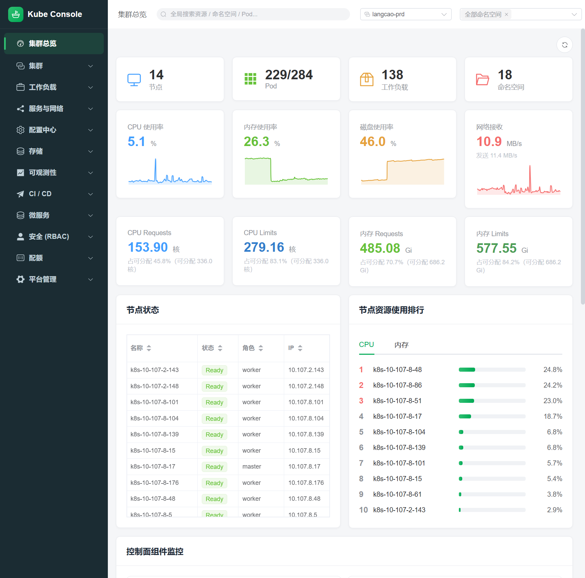

## 菜单结构

一级菜单 12 项（总览 + 11 个分组）：

```
集群总览
集群          集群管理（仅平台角色）· 命名空间 / 节点 / 自定义资源
工作负载       矩阵视图 / Deployment / StatefulSet / DaemonSet / CronJob / Job / Pod / HPA
服务与网络     服务与路由（服务 / EndpointSlice / 路由 / Ingress 类）· 网关（Gateway API 全量）· 网络策略
配置中心       ConfigMap / Secret / ServiceAccount
存储           PVC / PV / StorageClass
可观测性       监控 / 告警 / Grafana 面板 / 事件中心 / 日志检索
CI / CD       CI 流水线 / ArgoCD 应用 / ArgoCD 仓库 / Helm Releases / Chart 仓库
微服务         服务发现 / 配置管理（Nacos，登录即可用，跟随顶栏命名空间）
安全 (RBAC)    Role / RoleBinding / ClusterRole / ClusterRoleBinding
配额           ResourceQuota / LimitRange
平台管理       用户 / 授权 / 角色 / 审计 / 通知 / Nacos 管理 / 镜像仓库 / 用量报表 / 备份概览
              （platform-admin 全量；platform-viewer 只读授权·角色·审计·报表·集群）
```

隐藏路由（不在菜单，由列表跳转进入）：工作负载详情 `/workloads/:kind/:name`、Pod 详情 `/pods/:ns/:name`、节点详情 `/nodes/:name`、命名空间监控 `/monitor/namespace/:name`、Helm Release 详情 `/helm/releases/:name`、CRD 浏览 `/crd/:group/:version/:resource`、流水线设计器 `/ci/pipelines/:id/design`。

## 功能全景

### 集群与资源

| 模块 | 功能 |
| --- | --- |
| 集群管理 | kubeconfig 粘贴注册 / 编辑 / 删除 / 连通性测试，多集群界面切换；Prometheus 地址按集群配置 + 连通性测试；**Grafana 地址按集群配置**（iframe 内嵌面板）；**熔断**：连接异常的集群自动标记，避免请求长时间挂起；**权限**：页面与 `/clusters` 完整列表仅 platform-admin（viewer 只读），普通用户经 `/my-clusters` 只取顶栏切换所需最小字段（名称/状态/Grafana 地址） |
| 命名空间 | 列表 / 创建 / 删除 / 搜索，一键进入**命名空间监控**独立页 |
| 节点 | 列表与详情（容量、Conditions、污点、节点上 Pod、监控面板）；**运维操作**：封锁/解除封锁（cordon）、排水（drain，可选 force / 忽略 DaemonSet / emptyDir 处理 / 宽限期 / 超时）、污点与标签编辑；**节点终端**：自动创建 nsenter 调试 Pod 进入宿主机 shell（**需集群级写权限**） |
| 自定义资源 | discovery 驱动的**资源浏览器**：按 API group 折叠展示全部官方资源与 CRD（KubeBlocks / Elastic / Tekton / Gateway API 等），搜索 / 强刷 / 浏览 / 删除 / YAML 编辑 |
| 配额 | ResourceQuota 总览（按命名空间汇总 used/hard，可编辑）+ LimitRange |

### 工作负载与 Pod

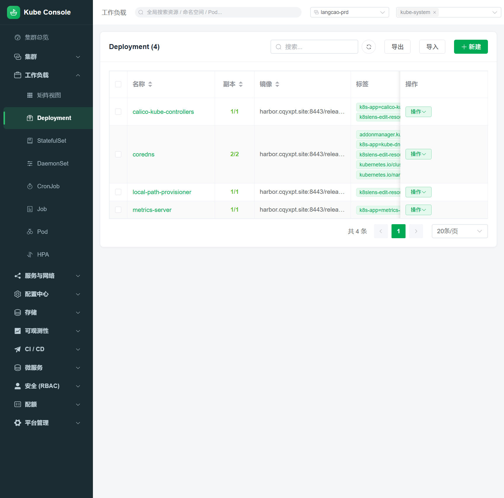
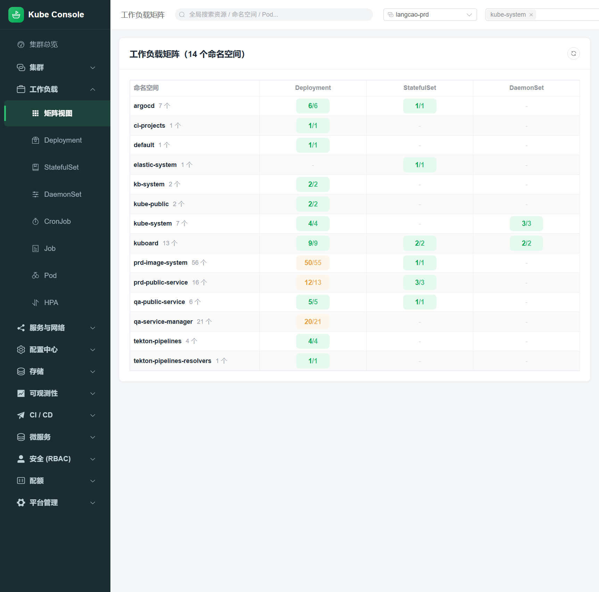

| 模块 | 功能 |
| --- | --- |
| 控制器列表 | Deployment / StatefulSet / DaemonSet / CronJob / Job / HPA：搜索、**批量删除 / 批量重启**、行内缩放 / 滚动重启 / 回滚 / 删除、**导出 / 导入**、新建（表单 + YAML）；Pod 融入同一列表框架（状态 / 就绪 / 重启 / IP / 节点 / 镜像列） |
| 矩阵视图 | 命名空间 × 工作负载类型二维矩阵（ready/total 着色），点格子直达对应列表 |
| 工作负载详情 | 左树右面板：关联 Pod 与事件、**缩放 / 滚动重启 / 发布历史与一键回滚**（rollouts 时间线）、**调整镜像**（Tag 下拉来自已配置仓库，可手填）、容器级监控面板、日志采集开关、YAML / 表单编辑 |
| Pod 详情 | 容器与初始化容器状态、Conditions、事件、**容忍**、Pod 监控；**Web 终端**、**日志**、**容器文件浏览器**（浏览 / 下载 / 上传 / 新建 / 重命名 / 删除）、**镜像 CVE 徽标**（点击弹明细）、驱除（Eviction API，尊重 PDB）与删除 |

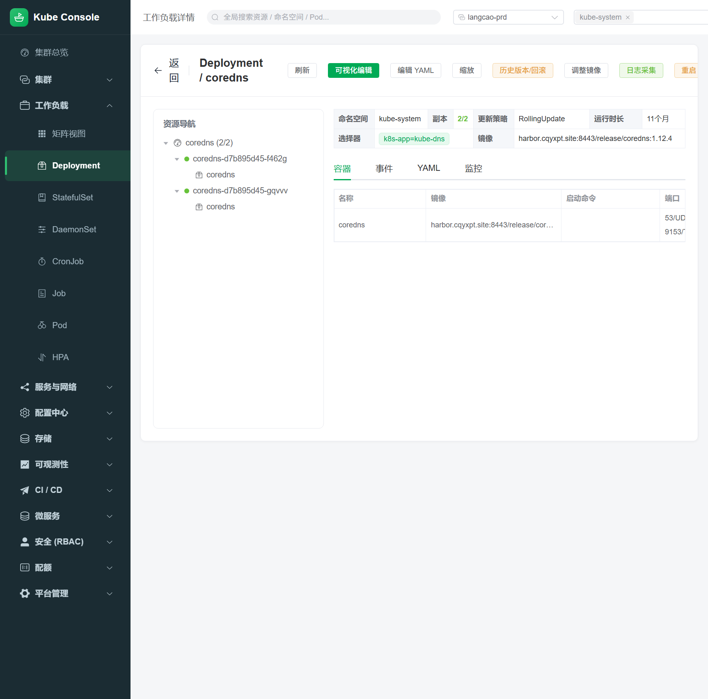
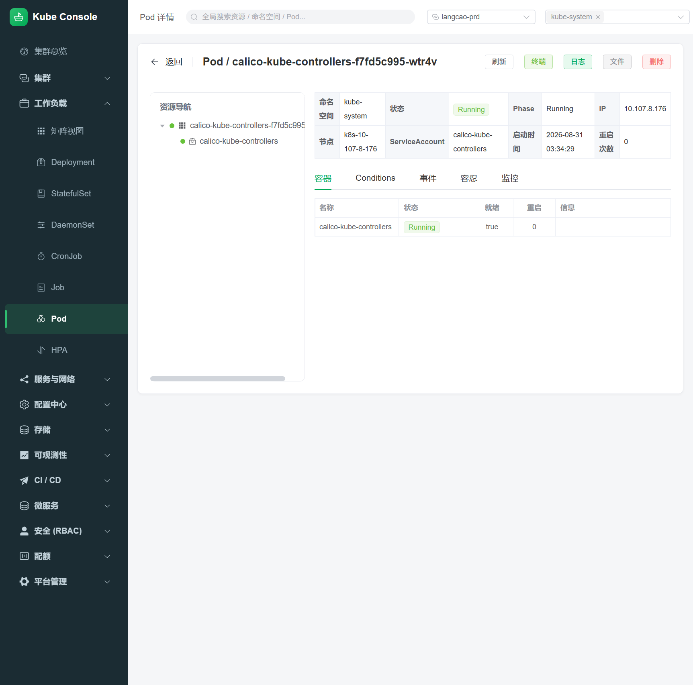

| 模块 | 功能 |
| --- | --- |
| Web 终端 | Pod 内 Shell（WebSocket exec）：容器无 shell 时自动回退 `/bin/bash`/`/bin/ash`；distroless 镜像注入临时调试容器（`kubectl debug` 风格，镜像 `k8s.debugImage` 可配，默认 `busybox:1.36`）；终端尺寸自适应。**权限**：Pod 终端与文件浏览走 pods/exec，需该命名空间写权限（edit/admin 或平台管理员） |
| 容器内日志采集 | 给 Deployment / StatefulSet / DaemonSet 注入 **fluent-bit Sidecar**，与目标容器共享 emptyDir 后 tail 容器内日志文件写集群 ES（复用「平台管理-日志源配置」）。两条索引：**单行文本**写行日志索引（与标准输出同库），**JSON** 字段展开并保留原始行、写独立 JSON 索引；开启或改配置会修改 Pod 模板触发滚动更新，关闭即摘除 Sidecar 与 ConfigMap/Secret |
| 可视化编辑 | 表单 + YAML 双视图：工作负载（容器 / 镜像 / 环境变量 / 端口 / 资源限制 / 探针 / 挂载 / 卷 / 容忍 / 调度 / 更新策略）、Service（**标签选择器级联下拉**：key/value 选项来自命名空间内 Pod 现有标签）、Ingress、ConfigMap、Secret、PVC、PV、StorageClass、NetworkPolicy、HPA、ServiceAccount、Role / ClusterRole（规则编辑器）、RoleBinding / ClusterRoleBinding、ResourceQuota、LimitRange、Gateway API 全量资源（**路由后端三级级联下拉**：命名空间 → Service → 端口名）；其余资源 YAML 编辑兜底 |
| 镜像 Tag 自动补全 | 编辑镜像字段后自动拉取该仓库可选 Tag 下拉（Harbor，700ms 防抖） |

### 可观测性

**监控**（PromQL 即席查询 + 五级下钻）

| 层级 | 入口 |
| --- | --- |
| 集群 | 集群总览（见上文截图） |
| 命名空间 | `/monitor/namespace/:name` 独立页 |
| 节点 | 节点详情 → 监控 |
| 工作负载 | 工作负载详情 → 监控（按容器聚合） |
| Pod | Pod 详情 → 监控 |

「可观测性 → 监控」页提供 **PromQL 控制台**：表达式输入 + 即时/区间图（ECharts）+ 结果指标表 + 时间范围 `1h/6h/24h`，内置快捷查询（集群 CPU / 集群内存 / 节点 CPU 使用率 / Pod 数量 / API 请求 QPS / 节点负载），用于临时验证指标与容量。

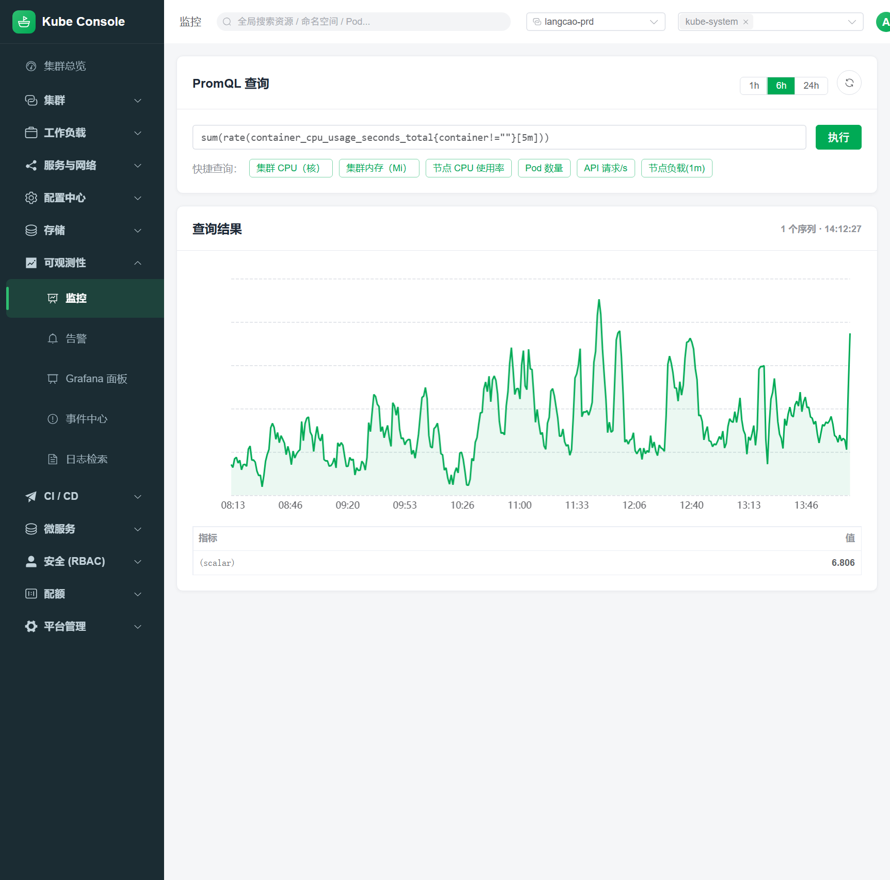
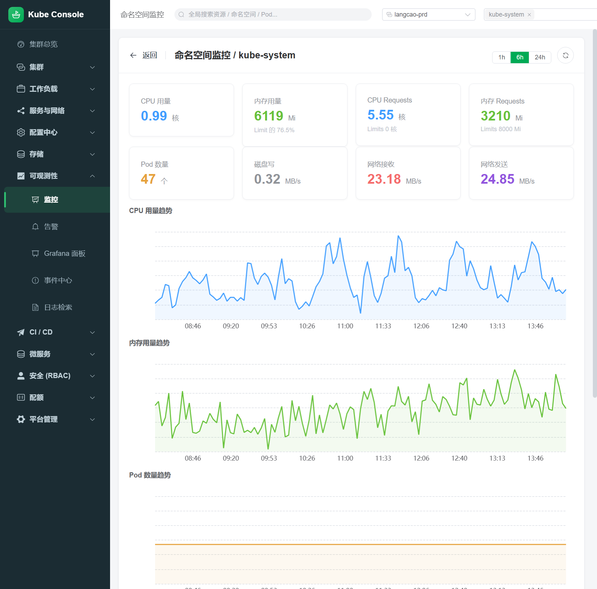

| 模块 | 功能 |
| --- | --- |
| 告警规则 | 基于 Prometheus `/api/v1/rules`：firing/pending/inactive、严重度统计、过滤、规则详情与活动实例；每条规则标注来源 PrometheusRule CR，支持**在线查看 / 编辑 / 新建 / 删除**（单条规则粒度写回 CR，prometheus-operator 数秒内热重载）；**规则检查**扫描缺 severity / namespace / summary / runbook 等配置缺陷 |
| Alertmanager | 接入集群 AM（apiserver proxy / 直连，未配置优雅降级）：**实时告警**（含 silenced/inhibited、30s 自动刷新）、**静默管理**（告警行一键静默 + 自定义匹配器/时长）、**主配置 YAML 在线编辑**（Secret 内 `alertmanager.yaml[.gz]` 自动识别，内置钉钉/邮件/企微/Slack receiver 模板片段；恢复通知 = `send_resolved: true`）、**告警历史归档**（服务端轮询 AM 按指纹状态机落库，触发/恢复/持续时长 + 统计卡片，默认保留 90 天） |
| 事件中心 | 实时：全集群 K8s 事件聚合（30s 自动刷新，页面隐藏自动暂停），按类型 / 对象 / 命名空间过滤；**归档检索**：服务端轮询 Events 增量写入 ES（`kc-events-*` 按天滚动索引，复用日志源连接，默认保留 30 天），任意历史时段回查 |
| 日志检索 | 对接 **Elasticsearch**（按集群配置日志源，支持连通性测试）：全文 + 字段查询、**来源筛选**（标准输出 / 文本文件 / JSON 采集，分别命中行日志索引与 JSON 索引）、Pod 分布 Top 侧栏点击即过滤、相对或绝对时间范围、**导出 CSV** |
| Grafana 面板 | 按集群配置地址后 iframe 内嵌（kiosk 模式，支持粘贴任意 dashboard 链接 + 常用面板收藏）；需 Grafana 开启 `allow_embedding` 与匿名只读 |
| 通知管理 | CI 流水线执行事件（成功/失败/待审批）推送到启用渠道；渠道支持**钉钉**（加签）与通用 webhook，可测连通；推送历史可查（K8s 告警通知走 Alertmanager） |

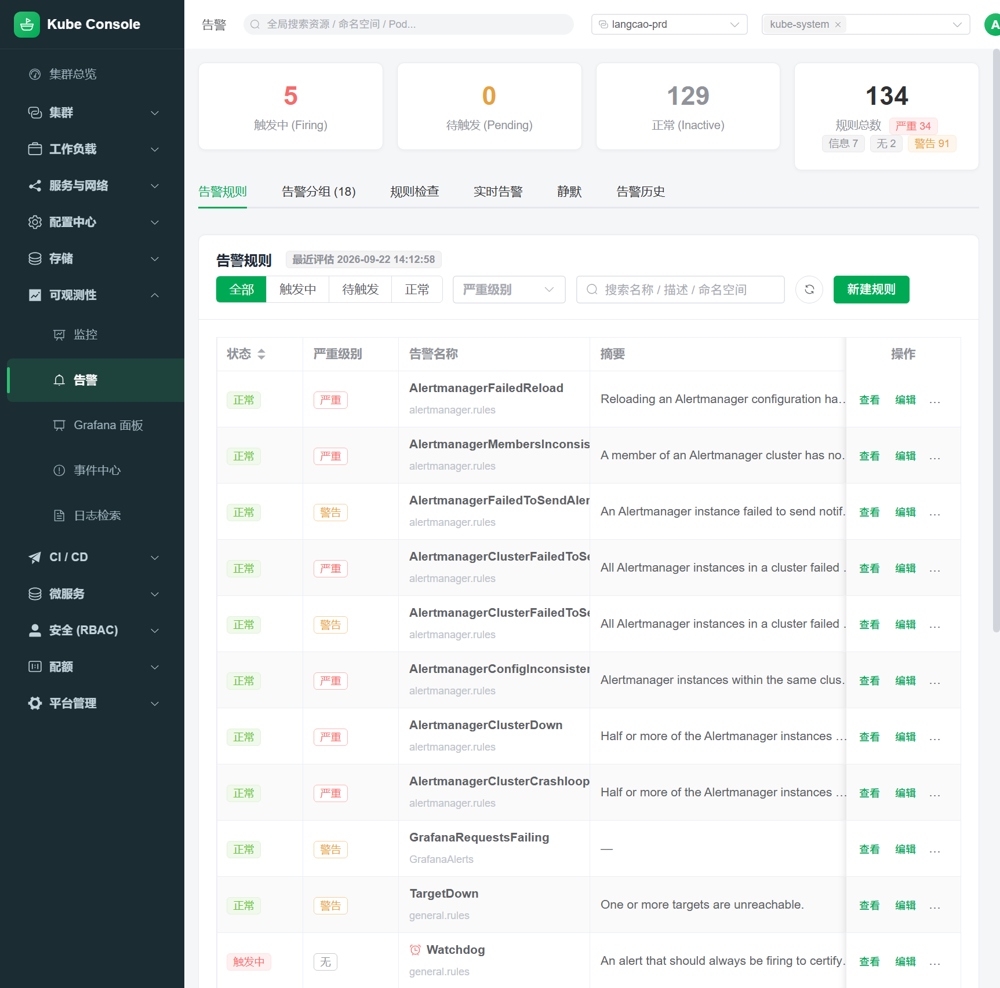
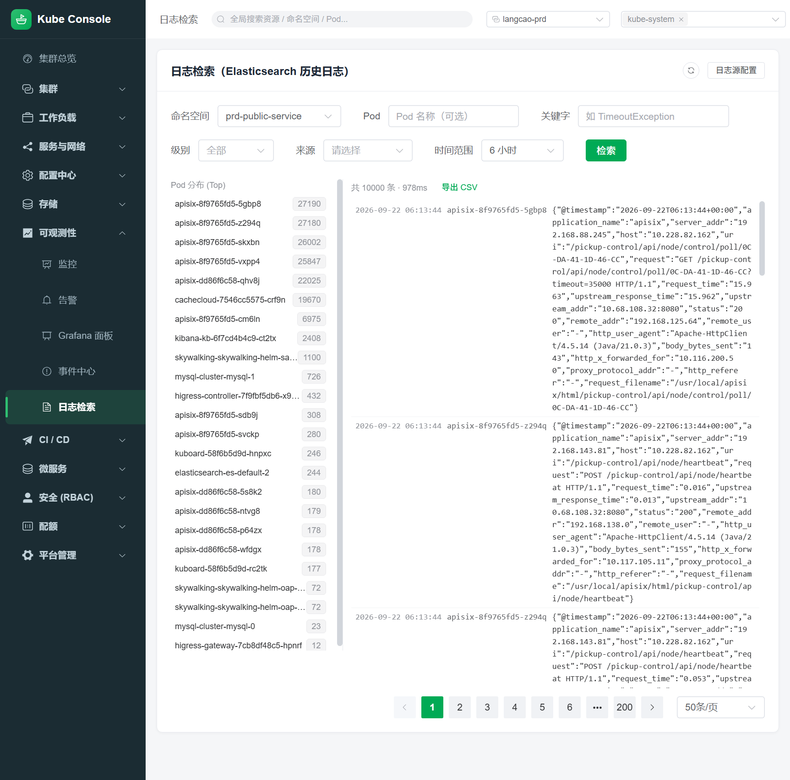

### CI / CD 与交付

| 模块 | 功能 |
| --- | --- |
| CI 流水线（内置 Tekton） | 原生模块，**集群隔离**（接口经 `X-Cluster` 选集群，Tekton 客户端按集群缓存）+ **命名空间隔离**（项目 = 一个 K8s ns，Pipeline/Run/工作区 PVC/凭证 Secret 全落项目 ns）：**执行中心**（统计卡 + WS 状态推送 + 5s 轮询兜底 + SSE 实时日志 + DAG 视图 + 人工审批 + 重跑 / 停止）、**流水线**（CRUD / 复制到项目 / 按分支或 Tag 运行）、**项目**、**凭据**（basic / token / dockerconfig / kubeconfig / aksk / raw 六类，Secret 扇出到平台 ns + 各项目 ns，轮换时留空保持不变）、**制品**（build-image / upload-artifact 成功自动登记，血缘详情 + MinIO/Nexus 流式下载代理）、**发布记录**（k8s-deploy / helm-deploy 镜像快照 + **一键回滚**）、**全局变量**（`${global.KEY}` 编译期注入）；未装 Tekton 的集群优雅降级；写操作限管理员，SSE/WS 用 60s 短期流 token 鉴权 |
| 可视化设计器 | vue-flow 画布 + **19 类节点插件**（随二进制 go:embed 分发）：git-clone、go-build、maven-build、gradle-build、npm-build、python-build、build-image、push-registry、image-verify、harbor-scan、trivy-scan、sonar-scan、k8s-deploy、helm-deploy、gitops-bump、argocd-sync、upload-artifact、approval、condition；属性面板 schema 驱动 + Git 分支/Tag/K8s 目标/凭据动态下拉、Dagre 自动布局、**JSON 导入导出 / 复制流水线 / 跨项目复制**、未保存离开拦截、**定时任务与 Webhook 管理**（Designer 设置内） |
| 节点间数据传递 | 节点参数可引用上游结果 `$(tasks.<任务名>.results.<结果名>)`（如 gitops-bump 的 images 填 `$(tasks.build-image-xxx.results.imageRef)`）；编译期校验连线依赖与结果声明，引用落在参数默认值时由编译器提升为 PipelineTask 级参数（Tekton 不替换内嵌 taskSpec 的默认值） |
| 触发方式 | 界面运行、**cron 定时**（瞬时失败快速重试）、**GitLab Webhook**（push/tag/MR，token 走 URL，事件去重） |
| ArgoCD 应用 | dynamic client 读 `applications.argoproj.io` / `appprojects.argoproj.io`。**贴近原生**：状态筛选 chips（Synced/OutOfSync/Healthy/Degraded/Progressing/Unknown/已暂停 + 计数）+ Project 下拉 + 名称搜索；动作组 **SYNC**（CR 内嵌 operation，老版本 CRD 不支持时明确提示）/ **PAUSE–RESUME** / 软·硬刷新 / 开关自动同步（prune+selfHeal）/ **删除**（级联勾选 = 自动补 `resources-finalizer`，需输入名称确认）；**详情抽屉**：托管资源层级树（按 ownerRef 组装，健康色点 / OutOfSync / 待剪枝 / 集群缺失标记，常见 kind 一键跳列表）、operationState、Conditions、概览、同步历史；GitOps 动作按目标命名空间写权限放行；spec 非法时列表顶部直接展示原因（InvalidSpecError）；可视化编辑（表单 + YAML，**Project 下拉只列已存在 AppProject** 并校验仓库与目标 ns 白名单） |
| ArgoCD 仓库 | v3 以带标签 Secret 存储（`argocd.argoproj.io/secret-type=repository`）：增删改查（账号密码 / SSH / insecure / LFS）、**主机级 URL 作为凭据模板**（同域仓库自动继承）、凭据只返回有无标志 |
| Helm | **Releases**：跨命名空间列表、详情（manifest / values / notes / history）、**安装**（仓库 → chart → 版本 → values + wait / timeout / atomic）、**升级 / 回滚到修订 / 卸载**；**Chart 仓库**：源管理（增删改 / 私有认证）、index 刷新（内存缓存 TTL）、chart 多版本浏览 |

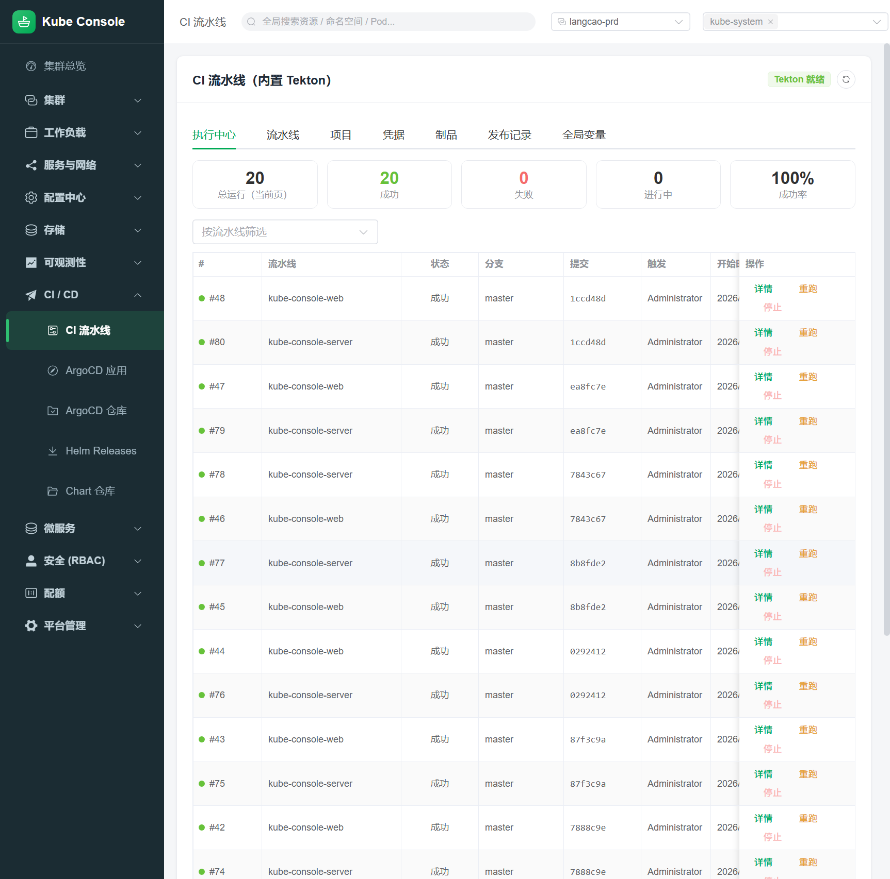

### Nacos 微服务集成

OpenAPI 客户端**自动探测版本风格**：1.x/2.x 走 v1 API，3.x 走 `/v3/admin` + `/v3/auth`（3.x 移除了 v1 console/admin API），同一地址无需区分配置。

| 模块 | 功能 |
| --- | --- |
| 服务发现（登录即可用） | 跟随顶栏命名空间选择、多命名空间合并展示：服务列表含分组 / 集群数 / 实例数 / 健康比，实例抽屉含 IP:端口 / 健康 / 权重 / 集群 / 元数据，可删除服务注册记录 |
| 配置管理（登录即可用） | 命名空间联动，配置查看 / 编辑 / 发布 / 删除，多命名空间合并展示；**JSON 导出 / 导入**（按原命名空间或统一导入到指定 ns，适合跨环境迁移） |
| Nacos 管理（admin） | 按集群接入：**命名空间自动同步**（每个 K8s ns 自动建同名 Nacos ns + `ROLE_<ns>` rw 授权，凭据落库可查看/重置，默认 5 分钟一轮、ns 创建即时联动）；**Pod 级自动注入**（Admission Webhook + 自签 TLS：注入 ns 内新建 Pod 自动追加 `nacos-config` ConfigMap 的 `envFrom` 与 `nacos-credentials` Secret，kubectl 直建同样生效，failurePolicy=Ignore 不阻塞业务）；Nacos 侧命名空间 / 用户浏览 |

### 服务与网络 / 配置 / 存储

| 模块 | 功能 |
| --- | --- |
| 服务与网络 | 三级菜单：**服务与路由**（服务 / EndpointSlice / 路由 / Ingress 类）、**网关**（GatewayClass / Gateway / HTTP·TCP·TLS·UDP·GRPC Route / ReferenceGrant，discovery 自动探测集群提供的版本，未装优雅降级）、**网络策略**；均支持可视化编辑 |
| 服务地址 | 服务列表「服务地址」列：**LoadBalancer 优先外部 IP、ExternalName 用目标名、其余用集群内 DNS**；多端口 Service 每端口一条（同端口 UDP/TCP 去重），逐条一键复制 |
| 配置中心 | ConfigMap / Secret / ServiceAccount 列表、编辑、YAML 视图 |
| 存储 | PVC / PV / StorageClass |
| 安全 (RBAC) | Role / RoleBinding / ClusterRole / ClusterRoleBinding（规则编辑器） |

### 导入导出

| 对象 | 功能 |
| --- | --- |
| K8s 资源 YAML | 通用资源列表页 **导出**（Kuboard 式逐层选择：命名空间 → 控制器 / 服务与路由 / 配置 / 其他资源四类勾选，类与类型级全选；多文档 `---` 分隔；深度清洗 uid/resourceVersion/managedFields/status/last-applied 注解，可直接再导入或入 Git；单项失败跳过并提示）；**导入**（上传 .yaml/.yml → 多文档预览（Kind/名称/命名空间）→ create-or-update 逐个应用，逐条成败反馈，失败不中断整批） |
| Nacos 配置 | 配置管理页 **导出**（所选命名空间全部配置含完整内容，JSON 文件，记录来源集群与时间）；**导入**（上传 JSON → 预览 → 按原命名空间或统一导入 → 逐条发布） |
| 报表与日志 | 用量报表、日志检索结果 **导出 CSV** |

### 镜像仓库（Harbor + Trivy）

| 模块 | 功能 |
| --- | --- |
| 接入与浏览 | Harbor API 接入（Basic 认证、可选跳过 TLS 校验、连通性测试）；**三步浏览**：项目 → 镜像仓库 → Tag（制品） |
| 漏洞扫描 | 对任意 Tag **触发扫描**（Harbor 内置 Trivy）并轮询状态；扫描概览（状态 / 最高级别 / C·H·M·L 计数） |
| CVE 报告 | 漏洞明细表格（级别筛选、CVE 链接、受影响包、安装 → 修复版本、**CVSS 分数着色**、修复状态）；双格式解析（Harbor 3.x 1.1 报告 + 2.x 旧格式） |
| Pod 维度 CVE | Pod 详情容器表「镜像 CVE」徽标（`CVE C·H·M`，点击弹明细）；镜像无仓库前缀或不在已配置仓库时优雅降级（灰标签 + 原因提示，不报错） |

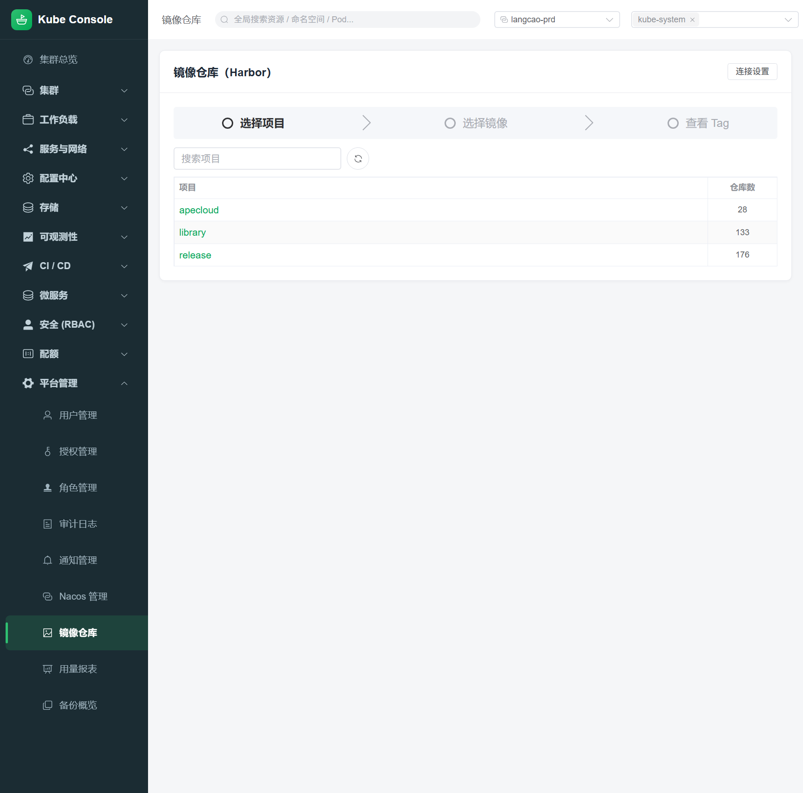

### 权限管理（KubeSphere 式层级 RBAC）

借鉴 KubeSphere 的多租户 RBAC 模型：以「角色」为权限基础，按**层级**把角色绑定给用户 / 用户组，前端据登录用户的角色快照动态渲染菜单与写操作按钮（真正的判定在后端逐接口强制）。

| 层级 | 定位 | 内置角色 | 说明 |
| --- | --- | --- | --- |
| 平台 (platform) | 控制台自身管理权限 | `platform-admin` / `platform-viewer` | admin=用户/授权/角色/集群注册/平台设置全量；viewer=授权、角色、审计、用量报表、集群管理**只读** |
| 集群 (cluster) | 特定集群的集群级操作 | `cluster-admin` / `cluster-viewer` | admin=节点运维、命名空间增删、告警静默、节点终端，且可写全 ns；viewer=只读 |
| 项目 (project) | 命名空间内资源读写 | `view` / `edit` / `admin` | 与 K8s 内置 ClusterRole 对齐（view 只读、edit 可改业务资源与 Pod 终端/文件、admin 含角色/配额） |

* **三层而非四层**：不提供「企业空间 (Workspace)」隔离单元（当前系统无该概念）；如后续引入，在 `service.BuiltinRoles` 扩一层并在授权向导加一步选择即可。
* **角色 = 内置 + 自定义**：内置角色启动时 seed、不可改删；平台管理员可在「角色管理」按 **API 授权项**（资源组 × 读/写/全部）勾选创建自定义角色，实现最小权限。
* **绑定以控制台记录为准**：授权记录落库（判定主数据源），并**同事务物化**为 K8s RBAC（`kc-rbac-<id>` 的 RoleBinding/ClusterRoleBinding，自定义角色生成 `kc-role-<name>` ClusterRole），kubectl 侧同样生效。
* **兼容旧数据**：旧「授权」页生成的 `kc-grant-*` 绑定继续被识别（按项目层授权展示），不做破坏性迁移；运维手工创建的 K8s RBAC 也仍参与判定（并集）。
* **敏感能力按层级收口**：Pod 终端 / 容器文件浏览需**项目层写权限**；节点终端（宿主机 root shell）需**集群层写权限**；集群管理页与 `/clusters` 完整信息仅**平台角色**可见。
* **用户与组**：先建用户再按层级绑定角色；未绑定任何角色的普通用户无写权限（资源读取登录即可浏览）。用户组作为绑定主体时组内成员继承权限。
* **审计**：认证后的非 GET 写操作自动落库（操作人 / 方法 / 路径 / 结果 / 时间），支持过滤分页与按保留期自动清理。

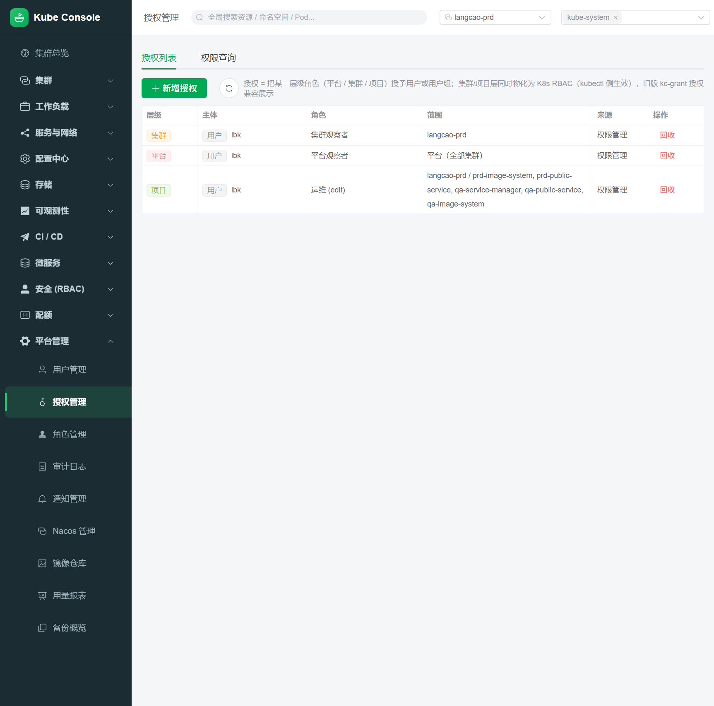

### 平台管理

| 模块 | 功能 |
| --- | --- |
| 用户管理 | 用户 CRUD、重置密码、角色（admin / user）、**用户组**（组可直接作为 K8s RoleBinding 的 Group 主体，按组批量授权） |
| 授权管理 | 三层授权向导：选层级（平台 / 集群 / 项目）→ 选主体（用户 / 组）→ 选角色（内置或自定义）→ 选范围；集群/项目层同步物化 K8s RBAC；列表合并展示旧版授权（可回收）；**权限查询**：控制台角色 + K8s 生效 RBAC 双视角 |
| 角色管理 | 内置角色只读展示；自定义角色按授权项目录勾选生成 |
| 审计日志 | 写操作审计，过滤与分页，按保留期自动清理 |
| 日志源 | 按集群配置 Elasticsearch：连接信息（ns/svc/port 或直连地址、basic auth）、**行日志索引前缀**（标准输出 + 单行文本采集，支持 `{namespace}` 占位符）、**JSON 采集索引前缀**（默认 `logstash-`）、事件归档开关与前缀 |
| 通知 / 镜像仓库 / Nacos / 备份 | 分别见对应章节；备份概览读取 **Velero** 备份与计划任务（只读，未安装时提示部署） |
| 用量报表 | 基于 Prometheus 历史指标（container_cpu/memory + kube-state-metrics）的命名空间用量区间报表（平均/峰值），**导出 CSV** |

## 技术栈

- **后端**：Go 1.25 / Gin / k8s.io/client-go v0.34（typed + dynamic + discovery）/ GORM / JWT + 个人 API Token / Helm v3 SDK / gorilla-websocket + SSE
- **前端**：Vue 3 + TypeScript + Vite + Element Plus + Pinia + CodeMirror 6 + js-yaml（表单 ↔ YAML 互转）+ ECharts 6 + xterm + vue-flow
- **存储**：SQLite（开发，纯 Go 驱动）/ MySQL / PostgreSQL（GORM 多驱动，config.yaml 切换）
- **CI 引擎**：Tekton（PipelineRun 由控制台编译下发），制品存储 Nexus / MinIO
- **外部集成**：Prometheus · Alertmanager · Grafana · Elasticsearch · Harbor(+Trivy) · ArgoCD · Velero · Nacos

## 架构

```
┌──────────────────────┐        ┌──────────────────────────────┐        ┌──────────────────┐
│  Vue 3 + Element Plus │  HTTP │      Go + Gin + client-go     │  HTTP   │   Kubernetes     │
│  可视化表单 + YAML 双视图│ ─────▶ │  集群注册表 + 连接缓存 + 熔断    │ ───────▶ │  kube-apiserver  │
│  ECharts + xterm      │        │  discovery 资源注册表          │         │  （含 CRD/Gateway/ │
│  Pinia 全局状态        │        │  Helm SDK + ws exec + 审计    │         │   ArgoCD）       │
└──────────────────────┘        └──────────┬───────────────────┘         └──────────────────┘
                                           │ GORM
                                           ▼
                              ┌──────────────────────────────┐
                              │ SQLite / MySQL / PostgreSQL   │
                              │ （用户/集群/HelmRepo/审计/渠道） │
                              └──────────────────────────────┘
  外部依赖（按集群或全局配置）：Prometheus · Elasticsearch · Tekton · argocd · Harbor · Nexus/MinIO · Velero
  监控/日志/告警一律访问集群内服务，无需对外暴露端口
```

## 快速开始

### 开发

```bash
# 后端（:8080，SQLite 默认 ./data/kube-console.db）
cd server && go run ./cmd/server

# 前端（:5173，vite 代理 /api → :8080）
cd web && npm install && npm run dev
```

首次登录：`admin / admin123`（生产请改 `configs/config.yaml` 并登录后改密）。

测试与构建：`cd server && go test ./...`、`cd web && npm test && npm run build`。

### 配置（configs/config.yaml）

所有字段均可用 `KC_` 前缀环境变量覆盖（如 `KC_DB_DSN`、`KC_JWT_SECRET`、`KC_ADMIN_PASSWORD`、`KC_CI_IMAGE_REGISTRY`）。

```yaml
server:   { port: 8080, logLevel: info }
database:
  driver: sqlite          # sqlite | mysql | postgres
  dsn: ./data/kube-console.db
jwt:    { secret: change-me-to-a-long-random-string, expireIn: 24 }   # 小时
admin:  { username: admin, password: admin123 }      # 首个管理员（启动 seed）
k8s:    { debugImage: busybox:1.36 }                 # 无 shell 容器注入的调试镜像

# 内置 CI（不接 Tekton 可整段省略，页面自动降级）
ci:
  enabled: true
  runTimeout: 2h
  pvcSize: 10Gi
  pvcStorageClass: ""            # 空 = 集群默认 StorageClass
  cacheEnabled: true
  cacheSize: 20Gi
  serviceAccount: ci-bot
  imagePullSecret: harbor
  platformNamespace: ci-platform
  imageRegistry: harbor.example.com/library   # 一处切换全部 CI 节点镜像仓库
  buildkitAddr: ""
  nexusUrl: ""                   # 制品下载代理（或 minioEndpoint）
  minioEndpoint: ""
  minioBucket: ""

# 归档轮询与保留
obs:
  alertIntervalSec: 60
  alertRetentionDays: 90
  eventIntervalSec: 60
  eventRetentionDays: 30

# Nacos 同步与 Pod 注入 Webhook
nacos:
  syncIntervalSec: 300
  webhookPort: 9443
  skipNamespaces: ""
  certDir: ./data
```

集群级外部依赖（Prometheus / Grafana / ES / Alertmanager / Harbor / Nacos / Helm 仓库）不写在配置文件里，登录后在界面上按集群配置，落库保存。

### 部署

前后端分开部署（前端 `web/dist` 静态文件 + 后端 Go 单二进制，经 Nginx 同源反代 `/api`）的完整步骤、Nginx 配置（WS/SSE 关键项）、systemd / Docker / K8s 三种形态与验证清单见 **[docs/deployment.md](docs/deployment.md)**。K8s manifest 在 `deploy/`（后端 Deployment + 前端 Deployment + Gateway API 路由，PostgreSQL）。

## 使用指引（常用路径）

1. **接入集群**：集群 → 集群管理 → 添加（粘贴 kubeconfig，自动校验连通性）→ 顶栏切换；顺手配 Prometheus / Grafana 地址解锁监控
2. **看应用**：工作负载 → Deployment 列表 → 行点击进详情（左树右面板）→ 进 Pod → 日志 / 终端 / 文件 / CVE
3. **发版**：CI / CD → CI 流水线 → 「设计器」可视化编排 → 运行（选分支/Tag）；或 Helm → Releases → 安装/升级；或 ArgoCD → 应用 → 新建（Git 目录 / Helm Chart，Project 必须是集群已存在的 AppProject；私有仓库先在 ArgoCD → 仓库 注册凭据）
4. **排障**：可观测性 → 监控（总览 → 命名空间 / 节点 / 工作负载 / Pod 五级下钻）/ 告警 / 事件中心 / 日志检索（「来源」区分标准输出 / 文本文件 / JSON 采集）；应用写文件日志的容器 → 工作负载详情「日志采集」开启 Sidecar；节点问题 → 节点详情 → 终端 / 排水 / 封锁
5. **授权**：平台管理 → 用户管理建用户/组 → 授权管理按平台·集群·项目三层绑角色 → 角色管理按需自定义最小权限；敏感操作（终端、排水、平台设置）按层级收口
6. **迁移与盘点**：各列表页「导出 / 导入」批量搬 YAML；平台管理 → 用量报表（导出 CSV）；镜像仓库触发扫描看 CVE 报告

## 文档

- [docs/api.md](docs/api.md) — 后端 API 参考（含各端点权限与入参）
- [docs/deployment.md](docs/deployment.md) — 前后端分开部署说明（Nginx 同源反代 / Docker / K8s）
- [docs/images.md](docs/images.md) — 镜像依赖清单与全局变量（`ci.imageRegistry` 一处切换全部 CI 节点镜像仓库）
- [docs/images/](docs/images/) — 本文件引用的功能截图
